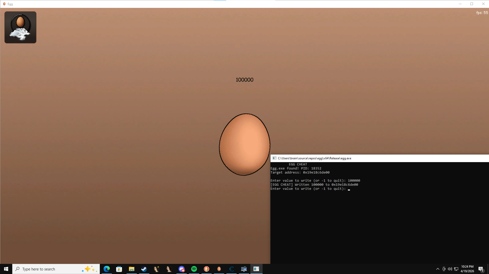

# egg-gamecheat
i was bored

## i use ntdll.dll 
to write to process memory

### simple rundown 
works by writing to the egg counter offset and allows you to change the offset value very simple

# showcase

